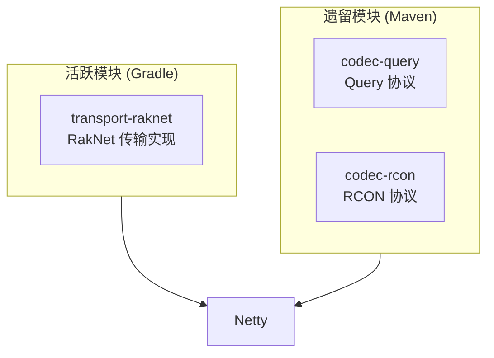
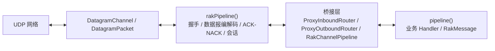

# 一、项目概述与系统全景架构

## 1.1 项目简介

Network 是 CloudburstMC 提供的 **网络组件库**，基于 Netty 实现了 RakNet 传输层、Query 查询协议和 RCON 远程控制协议。该库主要服务于 Minecraft: Bedrock Edition 相关项目。

| 属性         | 值                                    |
|------------|--------------------------------------|
| **JDK 版本** | 8                                    |
| **构建工具**   | Gradle (Kotlin DSL)                  |
| **核心模块**   | transport-raknet                     |
| **遗留模块**   | codec-query, codec-rcon (Maven)      |

## 1.2 模块组成

### transport-raknet

`transport-raknet` 是核心模块，目标是在 UDP 之上提供 RakNet 所需的可靠性能力，同时保持 Netty 原生使用方式。主要职责：

- 在 UDP 之上实现可靠传输、排序、分片、ACK/NACK 与拥塞控制
- 通过 `Bootstrap` / `ServerBootstrap`、`Channel` 与 `ChannelPipeline` 暴露一致的 Netty 使用体验
- 通过 `RakChannelFactory`、`RakChannelOption` 与双 Pipeline 结构分离协议层与业务层职责

### codec-query

基于 Netty UDP 的 Minecraft Query 协议实现，用于响应服务器状态查询请求。

### codec-rcon

基于 Netty TCP 的 RCON 远程控制协议实现，用于远程命令执行。

## 1.3 系统全景架构

## 1.4 核心结论

基于源码可确认以下关键结论：

1. **`pipeline()` 并不总是底层 I/O Pipeline。**  
   在 `ProxyChannel` 体系中，`pipeline()` 返回的是用户可见的代理 Pipeline；实际承载 UDP I/O 的是 `parent()` 指向的底层 `DatagramChannel`。

2. **客户端与服务端子连接的 `rakPipeline()` 结构不同。**  
   - `RakClientChannel.rakPipeline()` 直接返回底层 `DatagramChannel.pipeline()`
   - `RakChildChannel.rakPipeline()` 使用独立创建的 `RakChannelPipeline`

3. **服务端子连接的协议 Pipeline 先于用户 Pipeline 激活。**  
   `RakChildChannel` 构造时即初始化并激活内部 `rakPipeline()`；用户侧 `channelActive` 要等 `RakServerOnlineInitialHandler` 收到 `ID_NEW_INCOMING_CONNECTION` 后才触发。

4. **最大连接数限制已具备配置入口，但当前源码实现未在入口处完整落地。**  
   `RAK_MAX_CONNECTIONS` 已定义为配置项，但 `RakServerOfflineHandler` 中仍保留 `// TODO: max connections check?`。

5. **服务端限流器按需启用。**  
   `RakServerRateLimiter` 仅在 `packetLimit > 0` 时加入服务端 Pipeline。

## 1.5 源码包结构

| 包路径 | 职责 |
|---|---|
| `channel/raknet/` | Channel 体系、配置类、工厂类 |
| `channel/raknet/config/` | 服务端/客户端/会话配置实现 |
| `channel/raknet/packet/` | 封装包模型（EncapsulatedPacket、RakReliability 等） |
| `channel/proxy/` | ProxyChannel 代理基础设施 |
| `handler/codec/raknet/` | 协议处理器（服务端/客户端/通用） |
| `handler/codec/raknet/server/` | 服务端专用处理器 |
| `handler/codec/raknet/client/` | 客户端专用处理器 |
| `handler/codec/raknet/common/` | 通用处理器（Session、ACK、Ping/Pong 等） |
| `util/` | 工具类（最小堆、SipHash、分片辅助等） |
