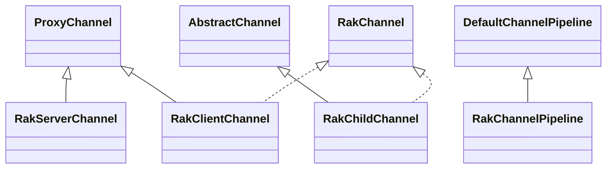
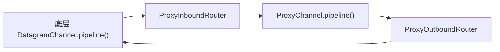
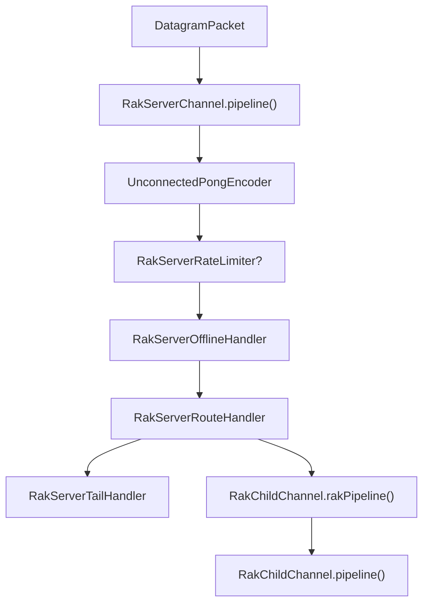

# 二、通道与双 Pipeline

## 2.1 Channel 体系概览

该实现的核心不是"一个 Channel 对应一个 Socket"，而是将不同层次的职责拆分到不同类型的 Channel 中。

| 类型 | 角色 | 核心职责 |
| --- | --- | --- |
| `ProxyChannel` | 代理基类 | 为底层真实 Channel 提供代理 Pipeline |
| `RakServerChannel` | 服务端入口 | 管理 UDP 监听、离线握手与子连接路由 |
| `RakClientChannel` | 客户端入口 | 管理单个远端连接并接管 `connect()` 握手过程 |
| `RakChildChannel` | 服务端子连接 | 表示单个客户端会话，承载用户 Pipeline 与独立协议 Pipeline |
| `RakChannel` | 抽象接口 | 统一暴露 `rakPipeline()` 与 `config()` |

## 2.2 `ProxyChannel`：双 Pipeline 的入口

`ProxyChannel` 是该设计的基础。它包装底层真实 Channel（通常为 `DatagramChannel`），并额外创建一条代理 Pipeline。

源码层面的关键事实包括：

- `pipeline()` 返回代理 Pipeline，而不是底层 `DatagramChannel.pipeline()`
- `parent()` 返回底层真实 Channel
- 构造时会把 `ProxyInboundRouter` 加入底层 Pipeline 末尾
- 构造时会把 `ProxyOutboundRouter` 加入代理 Pipeline 末尾

### ProxyInboundRouter

负责将底层 Channel 的入站事件转发到代理 Pipeline，覆盖的事件包括：

- `channelRegistered` / `channelUnregistered`
- `channelRead` / `channelReadComplete`
- `userEventTriggered`
- `channelInactive` / `channelWritabilityChanged`

此外，它会过滤 `ClosedChannelException`，避免将该异常直接透传到代理层。

### ProxyOutboundRouter

负责将代理 Pipeline 的出站操作委托到底层 Channel，包括：

- `bind` / `connect` / `disconnect` / `close` / `deregister`
- `read` / `write` / `flush`

它还通过 `correctPromise()` 将底层 Promise 的完成状态映射回代理 Channel 使用的 Promise。

## 2.3 `RakServerChannel`：服务端入口 Channel

`RakServerChannel` 继承 `ProxyChannel<DatagramChannel>` 并实现 `ServerChannel`。它本身不代表某个具体客户端会话，而承担以下职责：

- 维护 `SocketAddress -> RakChildChannel` 的连接映射
- 处理离线阶段的 Ping、`OCR1` 与 `OCR2`
- 将已建立连接的流量路由到相应的 `RakChildChannel`
- 在关闭时统一关闭所有子连接

### 服务端代理 Pipeline 顺序

根据 `initPipeline()`，服务端代理 Pipeline 顺序如下：

1. `UnconnectedPongEncoder`
2. `RakServerRateLimiter`（仅当 `packetLimit > 0` 时启用）
3. `RakServerOfflineHandler`
4. `RakServerRouteHandler`
5. `RakServerTailHandler`

### RakServerRouteHandler 的职责边界

按 `packet.sender()` 查找对应的 `RakChildChannel`：

- 若未找到子连接，则继续将 `DatagramPacket` 向后传递，最终由 `RakServerTailHandler` 丢弃
- 若找到子连接，则提取 `DatagramPacket.content()` 并直接转发至 `child.rakPipeline()`

## 2.4 `RakClientChannel`：客户端入口 Channel

`RakClientChannel` 同样继承自 `ProxyChannel<DatagramChannel>`，但其 `rakPipeline()` 设计与服务端子连接存在明显差异：

> `RakClientChannel.rakPipeline()` 直接返回底层 `DatagramChannel.pipeline()`。

这意味着客户端不会额外创建一条独立的内部协议 Pipeline；客户端协议处理直接部署在父 `DatagramChannel` 上。

### 客户端的两个视角

- **用户视角**：`RakClientChannel.pipeline()`，用于安装业务 Handler
- **协议视角**：`RakClientChannel.rakPipeline()`，本质上是底层 `DatagramChannel.pipeline()`

### 客户端初始化与动态装配

构造阶段先安装：

- 用户 Pipeline：`RakClientRouteHandler`
- 协议 Pipeline：
  - `RakClientProxyRouteHandler`
  - `UnconnectedPingEncoder`
  - `UnconnectedPongDecoder`

底层 `connect()` 成功后，`RakClientRouteHandler` 会将 `RakClientOfflineHandler` 动态插入到 `UnconnectedPongDecoder` 之后。

离线握手成功后，`RakClientOfflineHandler.onSuccess()` 会继续动态插入：

- `RakDatagramCodec`
- `RakAcknowledgeHandler`
- `RakSessionCodec`
- `ConnectedPingHandler` / `ConnectedPongHandler`
- `DisconnectNotificationHandler`
- `RakClientOnlineInitialHandler`
- `EncapsulatedToMessageHandler`

```mermaid
flowchart LR
    User["RakClientChannel.pipeline()"] --> Route["RakClientRouteHandler"]
    Route --> RakPipe["DatagramChannel.pipeline() = rakPipeline()"]
    RakPipe --> Proxy["RakClientProxyRouteHandler"]
    Proxy --> Ping["UnconnectedPingEncoder"]
    Ping --> Pong["UnconnectedPongDecoder"]
    Pong --> Offline["RakClientOfflineHandler\n(connect 后动态加入)"]
    Offline --> Datagram["RakDatagramCodec"]
    Datagram --> Ack["RakAcknowledgeHandler"]
    Ack --> Session["RakSessionCodec"]
    Session --> Online["RakClientOnlineInitialHandler"]
    Online --> Msg["EncapsulatedToMessageHandler"]
    Msg --> Inbound["ProxyInboundRouter"]
    Inbound --> User
```

## 2.5 `RakChildChannel`：服务端会话对象

`RakChildChannel` 表示服务端上的单个客户端连接。它同时拥有：

- `pipeline()`：用户业务 Pipeline
- `rakPipeline()`：内部 RakNet 协议 Pipeline

### 独立 `rakPipeline()` 的设计原因

为服务端子连接单独创建内部协议 Pipeline，主要出于以下考虑：

1. 协议处理固定在父事件循环内执行，降低业务 Handler 对协议处理时序的影响
2. 协议层与业务层清晰分离，用户只接触 `RakMessage` 与公开事件，而不直接处理 ACK、分片和重传细节

### 服务端子连接内部 Pipeline 顺序

在构造函数中，`RakChildChannel` 会依次安装：

1. `RakChildDatagramHandler`
2. `RakDatagramCodec`
3. `RakAcknowledgeHandler`
4. `RakSessionCodec`
5. `ConnectedPingHandler` / `ConnectedPongHandler`
6. `DisconnectNotificationHandler`
7. `RakServerOnlineInitialHandler`
8. `RakUnhandledMessagesQueue`

随后立即触发：

- `rakPipeline().fireChannelRegistered()`
- `rakPipeline().fireChannelActive()`

此处激活的是内部协议 Pipeline，而非用户 Pipeline。

## 2.6 `RakChannelPipeline`：协议层与用户层的桥接层

`RakChannelPipeline` 继承 `DefaultChannelPipeline`，用于将服务端子连接内部协议 Pipeline 未消费完的内容桥接到用户 Pipeline。

### 未处理消息的桥接方式

当内部 Pipeline 最终仍有未处理消息时，`onUnhandledInboundMessage()` 会：

- 若消息为 `EncapsulatedPacket`，先转换为 `RakMessage`
- 再通过 `child.pipeline().fireChannelRead(...)` 交给用户 Pipeline

### 其他桥接行为

- `onUnhandledInboundUserEventTriggered()`：将用户事件转发到用户 Pipeline；若事件为 `RakDisconnectReason`，同时关闭 child
- `onUnhandledInboundChannelInactive()`：将 child 标记为非活跃，并向用户 Pipeline 传播 `channelInactive`
- `onUnhandledInboundException()`：记录日志，不继续向用户层透传异常

## 2.7 `RakUnhandledMessagesQueue`：在线握手前的缓冲层

位于服务端子连接内部协议 Pipeline 尾部，其作用是：

- 在 `channel.isActive() == false` 时缓存 `EncapsulatedPacket`
- 以 50ms 周期轮询，待 child 真正激活后再将缓存消息继续向后转发
- 在消息排空且 child 已激活后，将自己从 Pipeline 中移除

该设计用于处理一个关键时序问题：内部协议 Pipeline 可能已开始接收在线阶段消息，而用户侧 `channelActive` 尚未正式触发。

## 2.8 本节小结

`pipeline()` 面向业务处理，`rakPipeline()` 面向协议处理；`ProxyInboundRouter`、`ProxyOutboundRouter` 与 `RakChannelPipeline` 共同构成了两层之间的桥接机制。这是 `netty-transport-raknet` 架构设计的核心。
