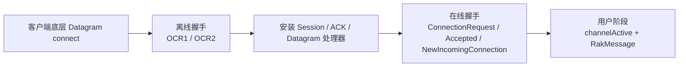
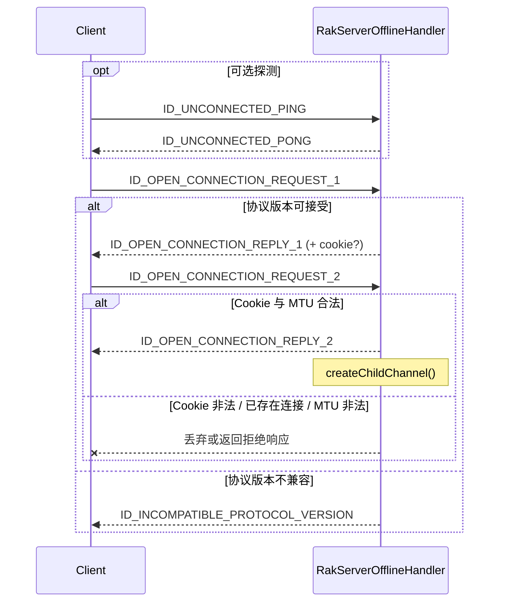
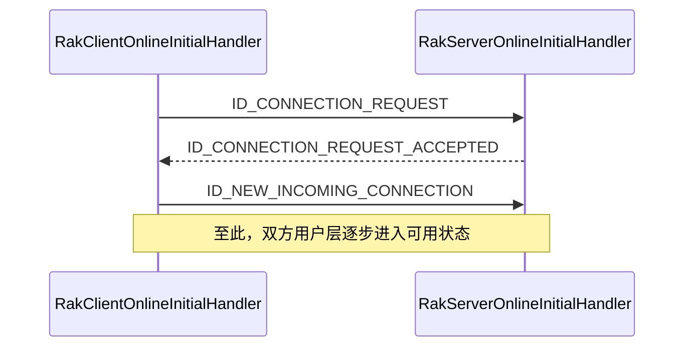
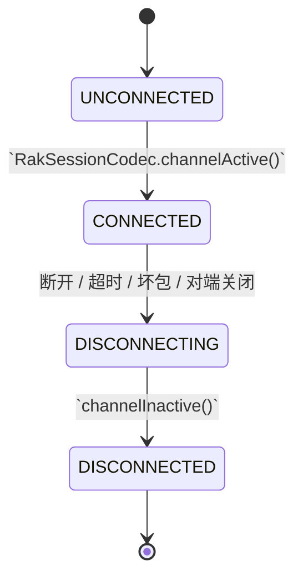
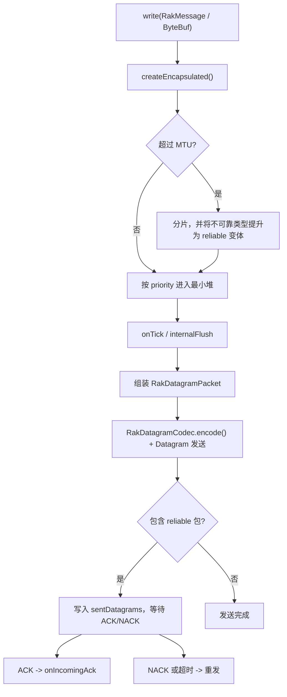

# 三、连接与会话

## 3.1 生命周期概览

一个可用的 RakNet 连接通常经历以下阶段：

需要明确区分以下几个时间点：

- **底层 UDP connect 成功**：仅表示底层 Socket 已与远端建立默认发送目标
- **`RakSessionCodec` 已装入并激活**：表示会话处理链已建立，但不等同于用户侧连接已完成
- **在线握手结束**：此时用户侧才能稳定收发 `RakMessage`

## 3.2 离线握手阶段

离线阶段主要由以下两个处理器协同完成：

- 服务端：`RakServerOfflineHandler`
- 客户端：`RakClientOfflineHandler`

### 离线握手时序

### 服务端离线处理的关键行为

`RakServerOfflineHandler` 在 `acceptInboundMessage()` 中只接受以下离线包：

- `ID_UNCONNECTED_PING`
- `ID_OPEN_CONNECTION_REQUEST_1`
- `ID_OPEN_CONNECTION_REQUEST_2`

且数据包必须携带正确的 `unconnected magic`。

进入处理逻辑后，服务端主要执行以下操作：

1. **Ping**：若未启用自定义 Ping 处理，则直接返回 `ID_UNCONNECTED_PONG`
2. **`OCR1`**：校验协议版本，并根据包体长度反推出 MTU，再裁剪到 `[minMtu, maxMtu]`
3. **`OCR2`**：校验 Cookie（若当前模式要求）、读取客户端 GUID、创建 `RakChildChannel`，并返回 `ID_OPEN_CONNECTION_REPLY_2`

### 当前实现边界

`RakServerOfflineHandler` 中仍保留以下 TODO：

- `// TODO: banned address check?`
- `// TODO: max connections check?`

这表明 `RAK_MAX_CONNECTIONS` 与地址封禁相关能力已经存在设计入口，但离线握手入口尚未形成完整的实现链路。

### 客户端离线处理的关键行为

`RakClientOfflineHandler` 主要承担三项职责：

1. 管理超时与重试
2. 推进 `HANDSHAKE_1 -> HANDSHAKE_2 -> HANDSHAKE_COMPLETED` 状态流转
3. 在离线握手成功后动态装配在线阶段与会话阶段所需处理器

在 `handlerAdded()` 中，它会创建：

- `timeoutFuture`：达到 `RAK_CONNECT_TIMEOUT` 后触发失败
- `retryFuture`：按 `RAK_TIME_BETWEEN_SEND_CONNECTION_ATTEMPTS_MS` 周期发起重试

### MTU 退避与兼容模式

客户端离线重试包含两类策略：

- **默认模式**：根据当前握手阶段重发 `OCR1` 或 `OCR2`
- **兼容模式**：只要离线握手未完成，就持续重发 `OCR1`，以贴近 vanilla 客户端行为

此外，客户端每 4 次尝试会将 MTU 退避到 `RAK_MTU_SIZES` 中的下一个值，默认序列为：`1400`、`1200`、`576`

## 3.3 在线握手阶段

离线握手完成后，客户端会将 `RakDatagramCodec`、`RakAcknowledgeHandler`、`RakSessionCodec` 等处理器插入 Pipeline，并触发内部 `channelActive`，随后进入在线握手阶段。

### 在线握手时序

### 服务端在线握手处理

`RakServerOnlineInitialHandler` 只处理两个包：

- `ID_CONNECTION_REQUEST`
- `ID_NEW_INCOMING_CONNECTION`

处理流程如下：

1. 收到 `ID_CONNECTION_REQUEST`：
   - 校验请求中携带的 server GUID 是否匹配
   - 校验 security 标志
   - 成功时返回 `ID_CONNECTION_REQUEST_ACCEPTED`
2. 收到 `ID_NEW_INCOMING_CONNECTION`：
   - 将自身从 Pipeline 中移除
   - 在 child 的事件循环内执行 `channel.setActive(true)`
   - 向用户 Pipeline 触发 `channelActive`

### 客户端在线握手处理

`RakClientOnlineInitialHandler` 的主要流程如下：

1. 在 `channelActive()` 中发送 `ID_CONNECTION_REQUEST`
2. 收到 `ID_CONNECTION_REQUEST_ACCEPTED` 后，组装并发送 `ID_NEW_INCOMING_CONNECTION`
3. 将 `RakClientOfflineHandler` 与自身从 Pipeline 中移除
4. 通过 `connectPromise.trySuccess()` 宣告连接建立，随后 `RakClientChannel` 再向用户 Pipeline 触发 `channelActive`

## 3.4 `RakSessionCodec`：会话核心

在线握手之后，真正负责维持可靠、有序、可重传会话的是 `RakSessionCodec`。其职责包括：

- 数据报序号管理
- reliable 包追踪
- ACK / NACK 收发与处理
- 排序通道维护
- 分片与重组
- 定时 flush 与过期重传
- 会话超时与主动断开

### `RakState` 的作用范围

`RakState` 用于描述 `RakSessionCodec` 内部维护的会话状态，而不是完整的连接全生命周期状态。

离线握手本身不在 `RakState` 的状态范围内。

## 3.5 出站链路：`RakMessage` 到 UDP 数据报

### `createEncapsulated()` 的职责

根据 `RakMessage` 生成一个或多个 `EncapsulatedPacket`，负责：

- 写入可靠性与优先级相关元信息
- 为 reliable 包分配 `reliabilityIndex`
- 为 ordered 包分配 `orderingChannel` 与 `orderingIndex`
- 在超过 MTU 时执行分片，并写入 `partId / partIndex / partCount`

如果消息需要分片，而原始可靠性为 `UNRELIABLE`、`UNRELIABLE_SEQUENCED`、`UNRELIABLE_WITH_ACK_RECEIPT`，则实现会自动将其提升为对应的 reliable 变体。

### 优先级调度

非 `IMMEDIATE` 消息会进入 `FastBinaryMinHeap`，按权重调度发送；`IMMEDIATE` 消息则直接通过 `sendImmediate()` 发送，每个包独立组装为一个 `RakDatagramPacket`。

## 3.6 入站链路：接收数据报后的处理过程

`RakSessionCodec.channelRead()` 收到 `RakDatagramPacket` 后，大致按以下顺序处理：

1. 更新时间戳 `lastTouched`
2. 记录需要回复的 ACK / NACK 序号区间
3. 对 reliable 包执行去重与缺口跟踪
4. 对 split 包尝试重组
5. 对 ordered 包按 ordering channel 入堆或顺序投递
6. 将可交付的 `EncapsulatedPacket` 继续向后传递

### ACK / NACK

`RakAcknowledgeHandler` 仅处理 ACK / NACK 类型的 `ByteBuf`，其工作包括：

- 识别 `FLAG_ACK` / `FLAG_NACK`
- 解析 `IntRange`
- 将结果放入 `RakSessionCodec` 的 `incomingAcks` 或 `incomingNaks` 队列
- 由下一次 flush 统一消费

消费时：

- **ACK**：释放对应 `sentDatagrams`，并更新 RTT 与拥塞窗口
- **NACK**：立即重发对应数据报，并触发滑动窗口的丢包反馈

### ordered 包的顺序保证

每个 ordering channel 都维护独立的最小堆：

- 若收到的包序号大于当前期待值，则先入堆
- 若正好等于当前期待值，则立即投递
- 每投递一个包后，再检查堆顶是否刚好衔接，若可连续投递则继续处理

有序保证仅发生在同一 ordering channel 内，不同 channel 之间互不排序。

### 分片重组

分片重组由 `SplitPacketHelper` 完成：

- 以 `partId` 为键维护待重组分片集合
- 收齐后按 `partIndex` 顺序拼接 payload
- 30 秒超时后自动释放，以防止长期占用内存

## 3.7 定时 Tick 机制

在 `RakSessionCodec.channelActive()` 中，会注册一个定时任务：

- 自动 flush 模式：按 `RAK_FLUSH_INTERVAL` 执行
- 手动 flush 模式：仍至少每 10ms 执行一次，以维持 RakNet 的基本时序

每次 Tick 主要执行以下工作：

1. 检查队列长度与会话超时
2. 处理入站 ACK / NACK
3. 发送待回复的 ACK / NACK
4. 重发过期数据报并发送新的数据报

此外，Tick 还会每 2 秒发送一次 `ID_CONNECTED_PING`，用于 RTT 估算与保活。

## 3.8 滑动窗口与拥塞控制

`RakSlidingWindow` 维护以下核心量：

- `cwnd`：拥塞窗口
- `ssThresh`：慢启动阈值
- `estimatedRTT` / `deviationRTT` / `lastRTT`
- `unackedBytes`：未确认字节数

整体上，该实现采用了简化的 TCP 风格拥塞控制策略：

- 在 ACK 到来时更新 RTT
- 慢启动阶段按 MTU 级别快速增长窗口
- 拥塞避免阶段转为线性增长
- 遇到重传或 NACK 时收缩阈值并回退发送窗口

关键估算公式：`RTO = 2 * estimatedRTT + 4 * deviationRTT + 30ms`，上限为 `2000ms`

## 3.9 断开连接路径

### 主动断开

`RakSessionCodec.disconnect()` 会：

1. 发送 `ID_DISCONNECTION_NOTIFICATION`
2. 在发送完成后向用户 Pipeline 触发 `RakDisconnectReason`
3. 再关闭 Channel

### 被动断开

被动断开主要来自以下场景：

- `DisconnectNotificationHandler` 收到对端断开通知
- Tick 检测到 `RAK_SESSION_TIMEOUT` 超时
- 坏包、队列过长等异常情况

## 3.10 `getMtu()` 的语义说明

`RakSessionCodec.getMtu()` 返回值为：

> `channel.config().getMtu() - UDP_HEADER_SIZE - IP_HEADER_SIZE`

即，会话层真正用于 `EncapsulatedPacket` 打包的有效空间已经扣除了 UDP 与 IPv4/IPv6 头部开销。

## 3.11 本节小结

离线握手负责建立连接前提，在线握手负责向用户层交付可用连接，而 `RakSessionCodec` 负责在整个连接生命周期内维持可靠、有序、可重传的会话语义。
