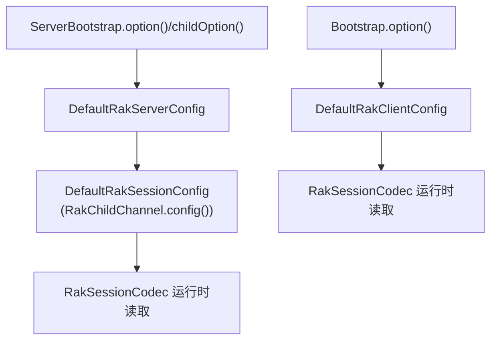

# 四、配置与实现边界

## 4.1 配置分层概览

该模块的配置并非单一平面结构，而是由服务端入口配置、客户端连接配置与子连接会话配置共同构成，并存在继承与回退关系。

其中一个关键事实是：

> `RakChildChannel.config()` 使用 `DefaultRakSessionConfig`；对于自身不识别的 `ChannelOption`，会回退到父 `RakServerChannel.config()`。

## 4.2 配置类层次

| 配置类 | 主要使用场景 | 说明 |
| --- | --- | --- |
| `DefaultRakServerConfig` | `RakServerChannel` | 服务端入口配置 |
| `DefaultRakClientConfig` | `RakClientChannel` | 客户端连接配置，继承自会话配置 |
| `DefaultRakSessionConfig` | `RakChildChannel` / 会话层 | 子连接与通用会话配置 |

## 4.3 会话层通用配置

以下配置主要影响 `RakSessionCodec`、分片、排序与 flush 行为。

| 配置项 | 默认值（源码） | 说明 |
| --- | --- | --- |
| `RAK_MTU` | `1400` | 会话配置中的 MTU；实际有效 payload 还需减去 UDP/IP 头部 |
| `RAK_ORDERING_CHANNELS` | `16` | 排序通道数量 |
| `RAK_SESSION_TIMEOUT` | `10000ms` | 会话超时 |
| `RAK_AUTO_FLUSH` | `true` | 是否自动 flush |
| `RAK_FLUSH_INTERVAL` | `10ms` | 自动 flush 周期 |
| `RAK_MAX_QUEUED_BYTES` | `64MB` | 待发送队列允许的最大字节数 |
| `RAK_METRICS` | 无 | 通道级指标采集接口 |

## 4.4 客户端配置

`DefaultRakClientConfig` 在 `DefaultRakSessionConfig` 基础上扩展了离线握手与兼容行为相关配置。

| 配置项 | 默认值（源码） | 说明 |
| --- | --- | --- |
| `RAK_UNCONNECTED_MAGIC` | `DEFAULT_UNCONNECTED_MAGIC` | 离线数据包魔数 |
| `RAK_CONNECT_TIMEOUT` | `10000ms` | 客户端连接超时 |
| `RAK_REMOTE_GUID` | `0` | 远端 GUID，握手后写入 |
| `RAK_COMPATIBILITY_MODE` | `false` | 是否采用更接近 vanilla 客户端的离线重试方式 |
| `RAK_MTU_SIZES` | `[1400, 1200, 576]` | `OCR1` 重试时的 MTU 退避序列 |
| `RAK_IP_DONT_FRAGMENT` | `false` | 是否尝试设置 IP DF |
| `RAK_CLIENT_INTERNAL_ADDRESSES` | `10` | 发送 `ID_NEW_INCOMING_CONNECTION` 时附带的内部地址数量 |
| `RAK_TIME_BETWEEN_SEND_CONNECTION_ATTEMPTS_MS` | `1000ms` | 连接重试间隔 |

## 4.5 服务端配置

`DefaultRakServerConfig` 主要影响离线握手、限流、Cookie 与服务端入口行为。

| 配置项 | 默认值（源码） | 说明 |
| --- | --- | --- |
| `RAK_GUID` | 随机 `long` | 服务端 GUID |
| `RAK_SUPPORTED_PROTOCOLS` | `null` | `null` 表示不限制协议版本 |
| `RAK_MAX_CONNECTIONS` | `0` | 已有配置项，但当前源码实现未在入口处完整强制执行 |
| `RAK_UNCONNECTED_MAGIC` | `DEFAULT_UNCONNECTED_MAGIC` | 离线握手魔数 |
| `RAK_ADVERTISEMENT` | `null` | Pong 广告数据 |
| `RAK_HANDLE_PING` | `false` | 是否将未连接 Ping 交给上层自定义处理 |
| `RAK_MAX_MTU` | `1400` | 服务端允许的最大 MTU |
| `RAK_MIN_MTU` | `576` | 服务端允许的最小 MTU |
| `RAK_PACKET_LIMIT` | `120` | 单地址每个 RakNet tick 允许的数据报数 |
| `RAK_GLOBAL_PACKET_LIMIT` | `100000` | 全局每个 RakNet tick 允许的数据报数 |
| `RAK_IP_DONT_FRAGMENT` | `false` | 是否尝试设置 IP DF |
| `RAK_SERVER_COOKIE_MODE` | `ACTIVE` | 服务端 Cookie 策略 |
| `RAK_SERVER_COOKIE_SECRET` | 随机 `32` 字节 | Cookie 密钥材料 |
| `RAK_SERVER_METRICS` | 无 | 服务端级指标采集接口 |

## 4.6 需要重点说明的配置项

### `RAK_MAX_CONNECTIONS`

该配置项已经具备服务端接口与配置存储，但当前源码中：

- `RakServerOfflineHandler.onOpenConnectionRequest1()` 仍保留 `// TODO: max connections check?`
- 客户端虽然能够处理 `ID_NO_FREE_INCOMING_CONNECTIONS`，但服务端离线入口尚未形成完整的"超限即拒绝"链路

> 该能力已具备配置入口与协议层预留，但当前实现尚未在入口处完整落地。

### `RAK_MAX_CHANNELS`

`RAK_MAX_CHANNELS` 已存在于 `RakChannelOption` 与服务端配置接口中，但在当前主会话读写逻辑中，直接参与有序投递的是 `RAK_ORDERING_CHANNELS`。二者需要明确区分：

- `RAK_ORDERING_CHANNELS`：会话层排序通道数
- `RAK_MAX_CHANNELS`：服务端配置接口中的上限概念，当前源码中未见其在主数据路径上的强约束行为

### `RAK_SERVER_COOKIE_MODE`

当前默认值为 `ACTIVE`，意味着：

- 服务端会在 `OCR1 Reply` 中下发 Cookie
- 客户端会在 `OCR2` 中回传 Cookie
- 服务端随后验证 Cookie，以降低源地址伪造攻击风险

## 4.7 限流、封禁与安全边界

### `RakServerRateLimiter`

当前实现包含双层限流：

- 全局包数限制
- 单 IP 包数限制

并配合短时间封禁表工作。是否生效取决于服务端 Pipeline 是否实际装入该 Handler，而装入条件为：

> `packetLimit > 0`

### Cookie / `SipHash`

服务端 Cookie 使用 `SipHash` 实现，主要特征包括：

- 密钥材料来自 `RAK_SERVER_COOKIE_SECRET`
- 默认构造 `DefaultRakServerConfig` 时会生成随机 32 字节密钥
- Cookie 用于 `OCR2` 验证，以缓解伪造源地址的连接请求

## 4.8 Metrics 与可观测性

源码中主要提供两类指标接口：

| 接口 | 粒度 | 使用位置 |
| --- | --- | --- |
| `RakChannelMetrics` | 单连接 / 单会话 | `RakSessionCodec`、客户端代理、子连接收发 |
| `RakServerMetrics` | 服务端入口级别 | 离线握手、Ping、Cookie 校验等 |

这些接口不会改变协议行为，但为上层埋点、监控与诊断提供了良好的扩展点。

## 4.9 工具类与辅助结构

| 类 | 作用 |
| --- | --- |
| `RakUtils` | 地址编解码、ACK/NACK 写出、Pipeline 反射创建/销毁、辅助 Datagram 回复 |
| `FastBinaryMinHeap` | 优先级调度与 ordered 包缓冲使用的最小堆 |
| `BitQueue` | reliable 包接收去重与缺口跟踪 |
| `RoundRobinArray` | 分片辅助结构 |
| `SplitPacketHelper` | 分片重组与超时释放 |
| `SipHash` | 服务端 Cookie 生成与校验 |
| `IntRange` | ACK / NACK 区间表示 |

### 反射创建与销毁 Pipeline

`RakUtils.newChannelPipeline()` 与 `RakUtils.destroyChannelPipeline()` 都使用了反射。其设计背景在于：

- `RakChildChannel` 需要独立的内部协议 Pipeline
- Netty 某些 Pipeline 生命周期能力并未直接作为公开 API 暴露
- 因此需要通过反射方式完成创建与销毁

## 4.10 当前实现边界摘要

### 已由源码明确确认的行为

- 客户端 `rakPipeline()` 直接指向底层 `DatagramChannel.pipeline()`
- 服务端 `RakChildChannel` 使用独立 `RakChannelPipeline`
- 子连接内部协议 Pipeline 先于用户 Pipeline 激活
- `RakUnhandledMessagesQueue` 会在 child 激活后自动排空并移除
- `RakSessionCodec.getMtu()` 返回的是扣除 UDP/IP 头部后的有效值

### 当前不宜表述为"完整实现"的能力

- 基于 `RAK_MAX_CONNECTIONS` 的完整拒绝链路
- 离线握手入口处的地址封禁完整检查
- `RAK_MAX_CHANNELS` 在主数据面上的强约束行为

## 4.11 本节小结

该模块的配置体系是分层组合结构，而不是单一配置表。阅读与对外说明时，应同时区分"已由源码确认的既有行为"与"已预留但尚未完整落地的能力"。
