# 五、netty-codec-query 模块

## 5.1 模块定位

`netty-codec-query` 是 CloudburstMC Network 仓库里的一个 **遗留 Maven 模块**，目录名为 `codec-query/`。

从当前仓库快照看，这个模块的目标是：

- 基于 Netty 的 UDP `DatagramChannel` 处理 Minecraft Query 协议
- 对外暴露一个轻量监听器，用于响应客户端的 Query 握手请求和统计信息请求
- 通过 `QueryEventListener` 回调，把服务端状态动态映射为 Query 协议要求的短格式/长格式响应数据

> 该模块属于未纳入当前 Gradle 多模块构建的旧模块，更适合被理解为"保存在仓库中的历史实现"。

## 5.2 模块整体职责

这个模块本质上是在做一件事：

> 把 UDP 数据报中的 Minecraft Query 协议消息，解码成 Java 对象，交给业务回调生成服务器状态，再编码回 UDP 响应包发回客户端。

| 层次 | 责任 |
| --- | --- |
| 网络监听层 | 绑定 UDP 地址，初始化 Netty pipeline |
| 协议编解码层 | 识别 Query 报文签名、区分握手包和统计包 |
| 业务处理层 | 校验 challenge token，调用监听器获取服务器状态 |
| 响应构建层 | 组装 short stats / long stats 两种格式的响应 |

## 5.3 目录与类职责概览

| 类/文件 | 作用 |
| --- | --- |
| `QueryNetworkListener` | 启动 UDP 监听并安装 pipeline |
| `QueryPacketCodec` | `DatagramPacket` 与 `DirectAddressedQueryPacket` 之间的转换 |
| `QueryPacketHandler` | 处理握手、token 校验、统计信息返回 |
| `QueryEventListener` | 暴露业务回调接口，供外部提供服务器状态 |
| `QueryEventListener.Data` | 持有服务器元数据，并懒加载生成响应缓存 |
| `QueryPacket` | Query 协议消息抽象接口 |
| `HandshakePacket` | 握手包模型 |
| `StatisticsPacket` | 统计查询包模型 |
| `QueryUtil` | Null 结尾字符串与固定 padding 的工具类 |
| `DirectAddressedQueryPacket` | 带收发地址信息的 Query 包封装 |

## 5.4 运行流程

### 初始化流程

`QueryNetworkListener` 继承 `ChannelInitializer<DatagramChannel>`，同时实现 `NetworkListener`。其初始化逻辑分为三步：

1. 接收监听地址 `InetSocketAddress` 和业务回调 `QueryEventListener`
2. 创建 `Bootstrap`，设置 `ByteBufAllocator.DEFAULT`
3. 通过 `Bootstraps.setupBootstrap(bootstrap, true)` 和 `EventLoops.commonGroup()` 配置 UDP 引导器

在 `initChannel()` 中，它向 pipeline 安装两个核心处理器：

1. `queryPacketCodec`
2. `queryPacketHandler`

### 数据流

```mermaid
flowchart LR
    A[UDP DatagramPacket] --> B[QueryPacketCodec decode]
    B --> C[DirectAddressedQueryPacket]
    C --> D[QueryPacketHandler]
    D --> E[QueryEventListener.onQuery]
    E --> F[QueryEventListener.Data]
    F --> G[StatisticsPacket or HandshakePacket]
    G --> H[QueryPacketCodec encode]
    H --> I[UDP DatagramPacket Response]
```



### 协议交互流程

#### 握手查询

客户端先发送 Handshake 请求，服务端返回一个 challenge token。

1. `QueryPacketCodec` 识别包前缀 `0xFE 0xFD`
2. 读取 packet id 为 `0x09`，映射为 `HandshakePacket`
3. `HandshakePacket.decode()` 读取 `sessionId`
4. `QueryPacketHandler` 为发送方地址计算 token
5. 服务端返回 `HandshakePacket`，其响应体中包含 token 字符串

#### 统计查询

客户端拿到 token 后，再发 `StatisticsPacket`：

1. `StatisticsPacket.decode()` 读取 `sessionId` 和 `token`
2. 如果 token 不匹配，直接丢弃请求
3. 如果匹配，则调用 `listener.onQuery(senderAddress)` 获取实时状态
4. 根据 `full` 标志返回 short stats 或 long stats
5. 再编码成 UDP 响应包写回

## 5.5 协议模型与报文结构

### 通用签名

`QueryPacketCodec` 在解码时要求每个 Query 数据报都以前缀字节开头：

- `0xFE 0xFD`

然后再读取 1 字节的包类型：

- `0x09`：Handshake
- `0x00`：Statistics

### `HandshakePacket`

- 请求包：只包含 `sessionId`
- 响应包：包含 `sessionId + token(\0 结尾字符串)`

### `StatisticsPacket`

| 字段 | 说明 |
| --- | --- |
| `sessionId` | 请求与响应关联 ID |
| `token` | 客户端带回的 challenge token |
| `full` | 是否请求完整统计信息 |
| `payload` | 响应负载 |

## 5.6 Query 数据生成机制

### `QueryEventListener`

模块与业务方之间唯一明确的扩展点：

```java
Data onQuery(InetSocketAddress address);
```

模块本身并不维护服务器状态；它只在收到 Query 请求时，向外部索取一份 `Data`。

### `QueryEventListener.Data`

`Data` 是实际的响应数据容器，字段包括：

- `hostname`、`gametype`、`map`
- `playerCount`、`maxPlayerCount`
- `hostport`、`hostip`
- `gameId`、`version`、`softwareVersion`
- `whitelisted`、`plugins`、`players`

这个类最关键的设计是：**懒加载并缓存 short stats / long stats 的 ByteBuf**。

### short stats 构建内容

按顺序写入：`hostname`、`gametype`、`map`、`playerCount`、`maxPlayerCount`、`hostport`（小端 short）、`hostip`

### long stats 构建内容

分三段生成：

1. 写入固定头部 `LONG_RESPONSE_PADDING_TOP`
2. 写入一组 key/value 形式的字符串对
3. 写入固定尾部分隔 `LONG_RESPONSE_PADDING_BOTTOM`，随后写玩家列表

## 5.7 当前实现的注意点

### 编码路径没有写入 Query 签名

`QueryPacketCodec.encode()` 当前只写入了 packet id 和 packet body，没有把 `QUERY_SIGNATURE` 写回响应包。

### token 刷新逻辑没有接入运行流程

`QueryPacketHandler` 内部有 `Timer timer`、`byte[] lastToken`、`refreshToken()`，但当前源码中：

- `timer` 仅被创建，没有看到调度任务
- `refreshToken()` 没有被调用

### 错误处理策略较轻

整体偏"静默丢弃"：

- 报文太短，直接忽略
- 签名不匹配，直接忽略
- packet id 不认识，直接忽略
- token 校验失败，直接忽略

## 5.8 使用方式

最直接的使用方式：

1. 实现一个 `QueryEventListener`
2. 在 `onQuery()` 中返回当前服务端状态
3. 用指定地址创建 `QueryNetworkListener`
4. 调用 `bind()` 开始监听
5. 在服务关闭时调用 `close()`
