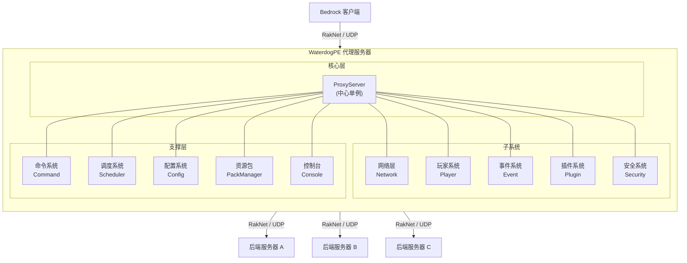
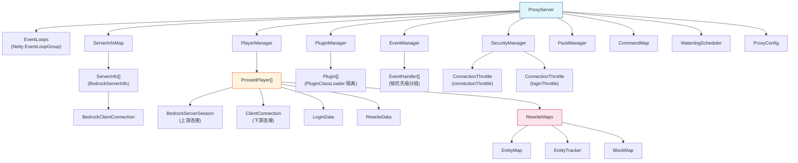

# 一、项目概述与系统全景架构

## 1.1 项目简介

WaterdogPE 是一个 **Minecraft: Bedrock Edition 代理服务器**，位于 Bedrock 客户端和后端服务器之间，负责协议翻译、服务器转移和数据包重写。当前版本通过 `protocol-extension` 编解码器增加了网易（NetEase）基岩版支持。

| 属性         | 值                                    |
|------------|--------------------------------------|
| **JDK 版本** | 17                                   |
| **构建工具**   | Maven                                |
| **入口类**    | `dev.waterdog.waterdogpe.WaterdogPE` |
| **核心包**    | `dev.waterdog.waterdogpe`            |
| **支持协议**   | Bedrock 1.8 ~ 1.26.0（含网易版）           |

## 1.2 系统全景架构

## 1.3 核心模块依赖关系

## 1.4 源码包结构

| 包路径 | 职责 |
|---|---|
| `network/connection/peer/` | RakNet 会话管理 |
| `network/connection/client/` | 代理→服务器连接 |
| `network/connection/codec/` | Netty 编解码组件 |
| `network/connection/handler/` | 连接策略接口 |
| `network/protocol/handler/upstream/` | 客户端→代理处理器 |
| `network/protocol/handler/downstream/` | 代理→服务器处理器 |
| `network/protocol/handler/` | 数据包桥接与路由 |
| `network/protocol/rewrite/` | ID 重写 |
| `network/serverinfo/` | 服务器注册 |
| `player/` | 玩家管理 |
| `event/` | 事件系统 |
| `plugin/` | 插件系统 |
| `scheduler/` | 任务调度 |
| `security/` | 安全管理 |
| `command/` | 命令框架 |
| `packs/` | 资源包管理 |
| `utils/config/` | 配置管理 |
| `console/` | 终端控制台 |
