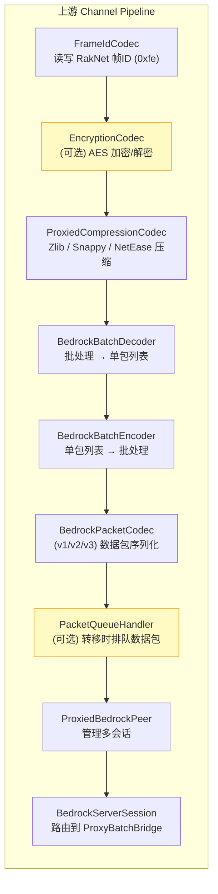
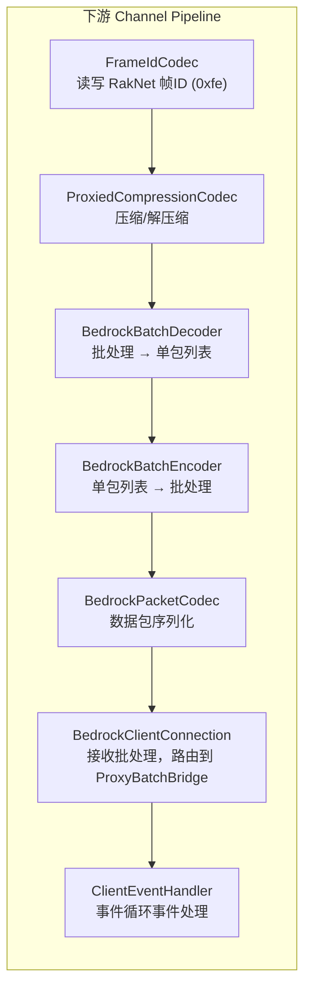
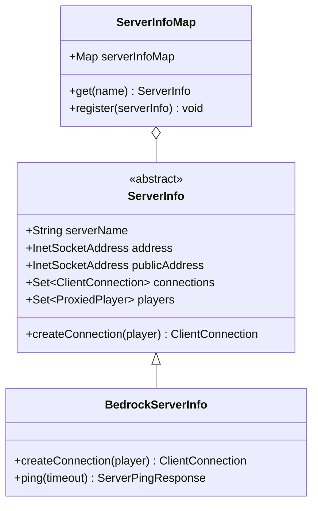

# 二、网络层架构

网络层是 WaterdogPE 最核心、最复杂的部分，负责管理客户端和服务器之间的所有网络通信。

## 2.1 核心类一览

### 连接对等体层（Peer Layer）

| 类 | 职责 |
|---|---|
| `ProxiedBedrockPeer` | 客户端→代理的 RakNet 会话，支持多子客户端（分屏），管理加密/压缩 |
| `BedrockServerSession` | 单个客户端会话，路由数据包到 `ProxyBatchBridge`，支持转移排队 |

### 客户端连接层（Client Connection Layer）

| 类 | 职责 |
|---|---|
| `ClientConnection` | 接口，定义代理→下游服务器连接的通用契约 |
| `BedrockClientConnection` | RakNet 实现，维护 MPSC 发送队列，50ms 间隔刷新 |

### 编解码层（Codec Layer）

| 类 | 职责 |
|---|---|
| `FrameIdCodec` | 处理 RakNet 帧 ID (0xfe) 的添加/移除 |
| `BedrockBatchDecoder` | 批处理数据 → 单个 `BedrockPacketWrapper` 列表 |
| `BedrockBatchEncoder` | 单个包列表 → 批处理数据（CompositeByteBuf 优化） |
| `ProxiedCompressionCodec` | 支持 Zlib/Snappy/NetEase 压缩算法 |
| `BedrockPacketCodec_v1/v2/v3` | 根据 RakNet 版本选择的数据包编解码器 |
| `PacketQueueHandler` | 服务器转移期间排队客户端数据包 |

### 协议处理器层

| 类 | 方向 | 职责 |
|---|---|---|
| `LoginUpstreamHandler` | 上游 | 登录握手、版本校验、网易检测 |
| `ResourcePacksHandler` | 上游 | 资源包交互和发送 |
| `ConnectedUpstreamHandler` | 上游 | 稳定状态下的客户端包处理 |
| `InitialHandler` | 下游 | 首次服务器连接的握手和初始化 |
| `ConnectedDownstreamHandler` | 下游 | 稳定状态下的服务器包处理 |
| `SwitchDownstreamHandler` | 下游 | 服务器转移期间的包处理 |
| `ProxyBatchBridge` | 桥接 | 核心路由，解码/重写/转发批处理包 |
| `TransferCallback` | 桥接 | 两阶段维度变化协调 |
| `PluginPacketHandler` | 桥接 | 插件数据包拦截入口 |

## 2.2 Netty Pipeline 结构

### 上游管道（客户端 → 代理）

> 黄色标注的组件为可选，在特定条件下动态添加。

### 下游管道（代理 → 服务器）

## 2.3 BedrockPacketCodec 版本选择

| RakNet 协议版本 | 编解码器 | 说明 |
|---|---|---|
| 7 | `BedrockPacketCodec_v1` | 早期版本 |
| 8 | `BedrockPacketCodec_v2` | 标准 RakNet v8 客户端 |
| 8（开启网易支持时） | `BedrockPacketCodec_v3` | 网易客户端强制使用 v3 编码格式 |
| 9 ~ 11 | `BedrockPacketCodec_v3` | 标准版本 |

## 2.4 EventLoops（事件循环）

`EventLoops` 负责选择最优的 Netty 事件循环实现：

| ChannelType | 平台 | 优先级 |
|---|---|---|
| `EPOLL` | Linux | 首选 |
| `KQUEUE` | BSD / macOS | 首选 |
| `NIO` | 跨平台 | 通用兜底 |

## 2.5 服务器信息层

