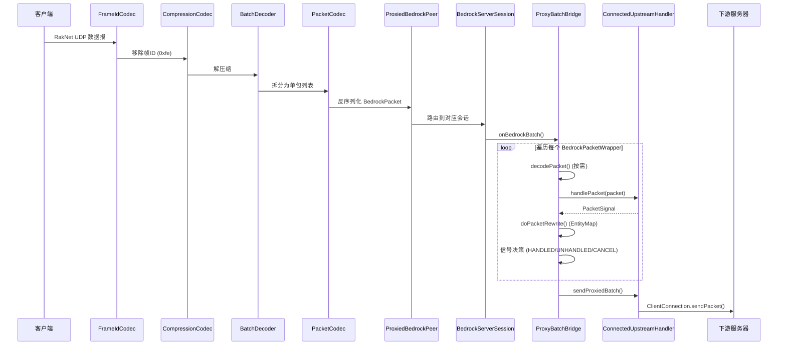
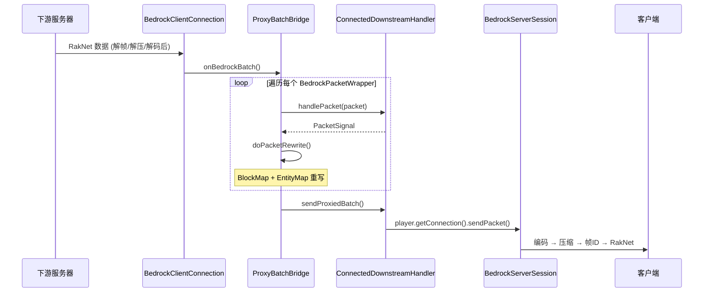
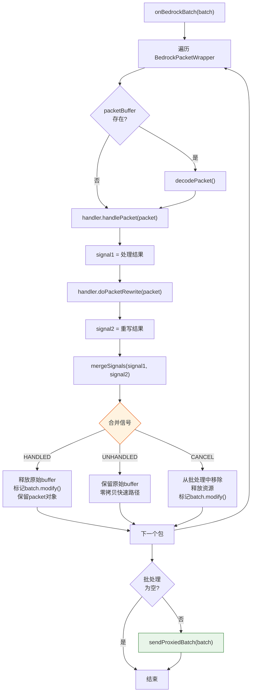
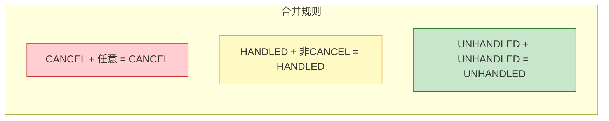

# 三、数据包完整流转路径

## 3.1 上游路径（客户端 → 代理 → 下游服务器）

## 3.2 下游路径（下游服务器 → 代理 → 客户端）

## 3.3 ProxyBatchBridge 处理流程详解

## 3.4 PacketSignal 信号机制

| 信号 | 含义 | 对批处理的影响 |
|---|---|---|
| `HANDLED` | 数据包被处理/修改 | 释放原始 buffer，标记需重新编码 |
| `UNHANDLED` | 数据包未处理 | 保留原始 buffer（零拷贝快速路径） |
| `CANCEL` | 数据包被取消 | 从批处理中移除，释放资源 |

### 信号合并规则（`Signals.mergeSignals`）

> 优先级：CANCEL > HANDLED > UNHANDLED
