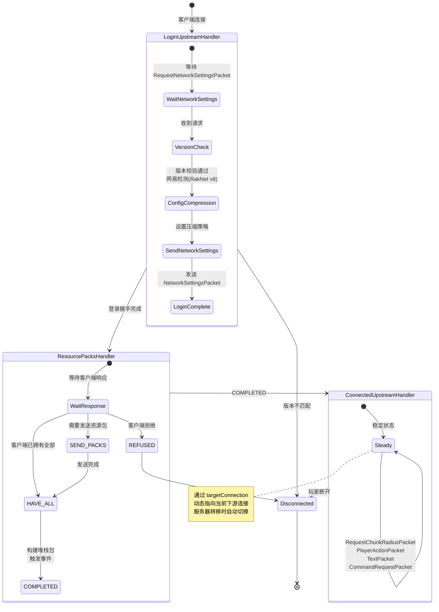
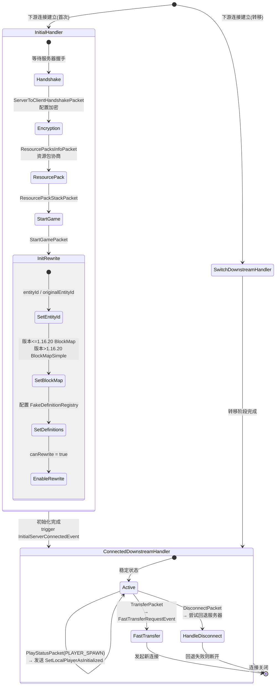
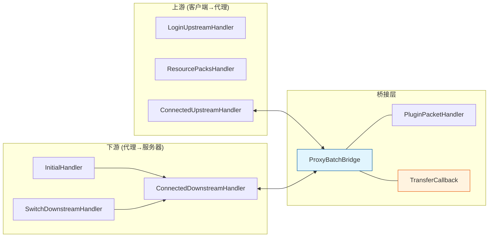

# 四、Handler 状态转换链

## 4.1 上游处理器状态机（客户端 → 代理）

## 4.2 下游处理器状态机（代理 → 服务器）

## 4.3 上下游处理器对应关系

## 4.4 各处理器处理的关键数据包

### ConnectedUpstreamHandler（上游稳定态）

| 数据包 | 处理逻辑 | 返回信号 |
|---|---|---|
| `RequestChunkRadiusPacket` | 存储半径值并转发 | UNHANDLED |
| `PlayerActionPacket` (DIMENSION_CHANGE_SUCCESS) | 转发给 TransferCallback | CANCEL |
| `TextPacket` | 触发 PlayerChatEvent，可取消 | HANDLED/CANCEL |
| `CommandRequestPacket` | 代理命令处理或转发 | UNHANDLED/CANCEL |
| `ClientCacheBlobStatusPacket` | 块数据缓存管理 | UNHANDLED |

### ConnectedDownstreamHandler（下游稳定态）

| 数据包 | 处理逻辑 | 返回信号 |
|---|---|---|
| `PlayStatusPacket` (PLAYER_SPAWN) | 发送 SetLocalPlayerAsInitialized | UNHANDLED |
| `TransferPacket` | 触发 FastTransferRequestEvent，发起快速转移 | CANCEL |
| `DisconnectPacket` | 尝试 sendToFallback，失败则断开 | CANCEL |
| `ItemComponentPacket` | 更新物品定义 (v1.21.60+) | HANDLED |
