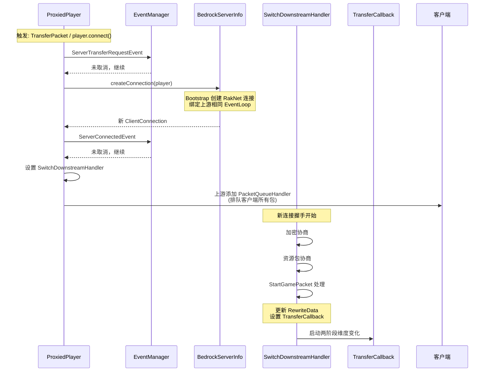
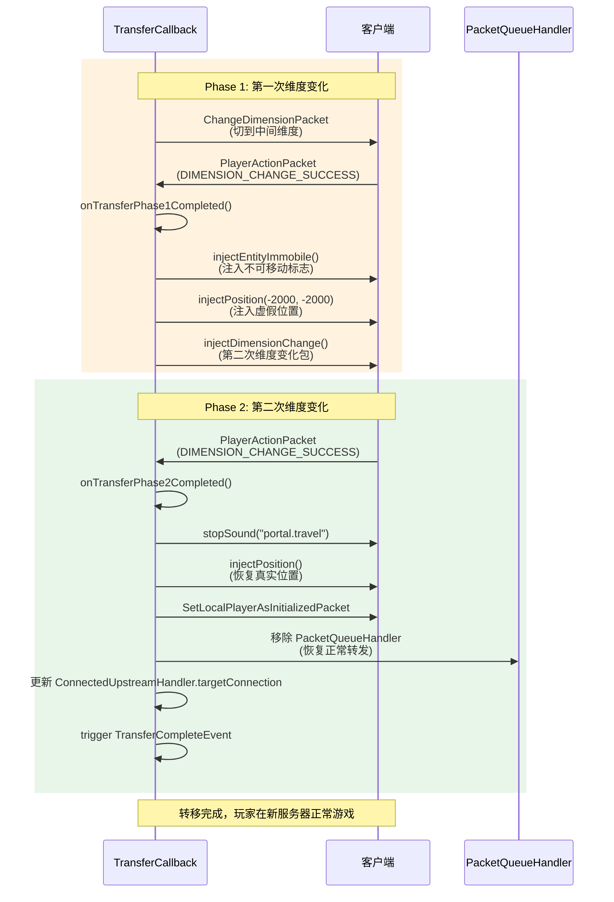
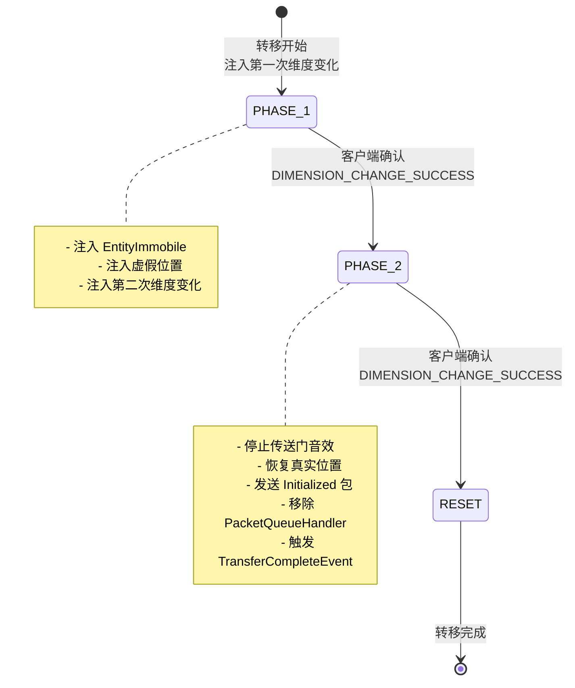
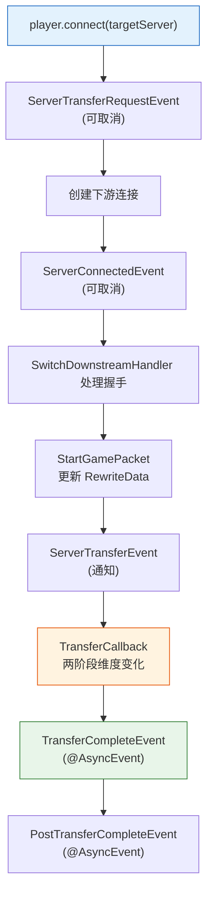

# 五、服务器转移（Transfer）完整流程

服务器转移是 WaterdogPE 最复杂的功能之一，需要在客户端无感知的情况下将玩家从一个后端服务器迁移到另一个。

## 5.1 转移触发与连接建立

## 5.2 两阶段维度变化（TransferCallback）

两阶段维度变化是实现无缝转移的核心机制。Minecraft 客户端在同一维度内无法直接重置世界数据，因此需要通过两次维度切换来清除客户端缓存。

## 5.3 转移阶段状态

## 5.4 转移过程中的数据包处理

| 阶段 | 客户端 → 代理 | 代理 → 旧服务器 | 代理 → 新服务器 |
|---|---|---|---|
| **转移开始** | PacketQueueHandler 排队所有包 | 继续处理 | 建立连接 |
| **Phase 1** | 排队，等待维度变化确认 | - | `SwitchDownstreamHandler` 握手 |
| **Phase 2** | 排队，等待维度变化确认 | 连接关闭 | 切换到 ConnectedDownstreamHandler |
| **转移完成** | PacketQueueHandler 移除，恢复正常 | - | 正常双向转发 |

## 5.5 完整转移事件链

