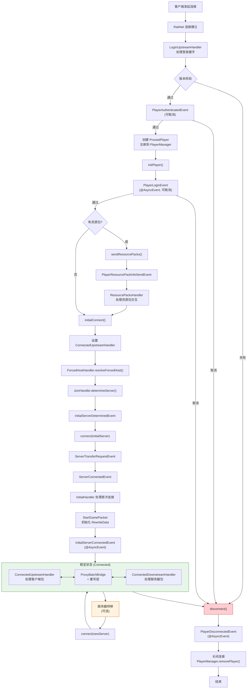

# 六、玩家完整生命周期

## 6.1 生命周期全览

## 6.2 ProxiedPlayer 核心属性

| 属性 | 类型 | 说明 |
|---|---|---|
| `connection` | `BedrockServerSession` | 上游客户端连接 |
| `clientConnection` | `ClientConnection` | 当前下游服务器连接 |
| `pendingConnection` | `ClientConnection` | 等待中的下游连接（转移时） |
| `loginData` | `LoginData` | 登录认证数据 |
| `rewriteData` | `RewriteData` | 实体/方块ID重写状态 |
| `rewriteMaps` | `RewriteMaps` | 跨服映射表集合 |
| `entities` | `LongSet` | 玩家已知的实体集合 |
| `bossbars` | `LongSet` | Boss 条 ID 集合 |
| `players` | `ObjectSet<UUID>` | 已知玩家 UUID |
| `permissions` | `Map<String, Permission>` | 权限表 |

## 6.3 关键状态标志

| 标志 | 说明 |
|---|---|
| `canRewrite` | 从 StartGamePacket 处理后开始允许 ID 重写 |
| `hasUpstreamBridge` | 第一次连接下游时建立桥接，后续转移不再重复 |
| `acceptPlayStatus` | 严格服务器（如 PMMP4）的 PlayStatus 处理控制 |
| `acceptResourcePacks` | PlayerResourcePackInfoSendEvent 可改变此值 |
| `disconnected` | AtomicBoolean，防止重复断开 |
| `loginCalled` | AtomicBoolean，防止重复触发登录事件 |
| `loginCompleted` | AtomicBoolean，标记登录流程完成 |

## 6.4 LoginData 核心字段

| 字段 | 说明 |
|---|---|
| `displayName` | 玩家显示名称 |
| `uuid` | 玩家 UUID |
| `xuid` | Xbox Live ID |
| `protocol` | 协议版本 |
| `devicePlatform` | 设备平台（Windows、Android、iOS 等） |
| `deviceModel` | 设备型号 |
| `deviceId` | 设备唯一标识 |
| `keyPair` | 加密密钥对 |
| `netEaseData` | 网易特定数据（可为空） |

## 6.5 关键方法

| 方法 | 说明 |
|---|---|
| `initPlayer()` | 初始化玩家，触发 PlayerLoginEvent |
| `initialConnect()` | 确定初始服务器并连接 |
| `connect(ServerInfo)` | 连接到指定服务器（触发转移流程） |
| `connectFailure()` | 连接失败时尝试回退服务器 |
| `disconnect(reason)` | 断开连接，触发事件，清理资源 |
| `sendPacket(packet)` | 异步发送数据包到客户端 |
| `sendMessage(msg)` | 发送聊天消息 |
| `chat(message)` | 模拟玩家发送消息/命令到当前服务器 |
| `hasPermission(perm)` | 检查权限（触发 PlayerPermissionCheckEvent） |
