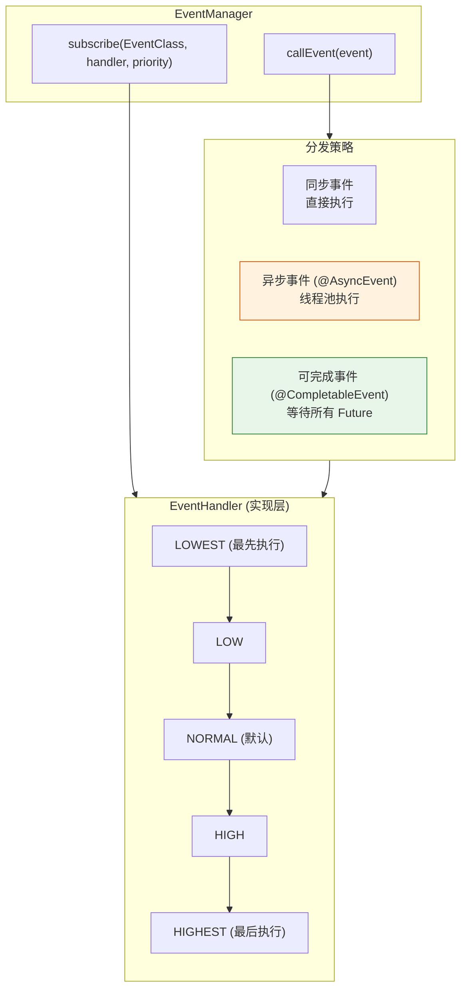
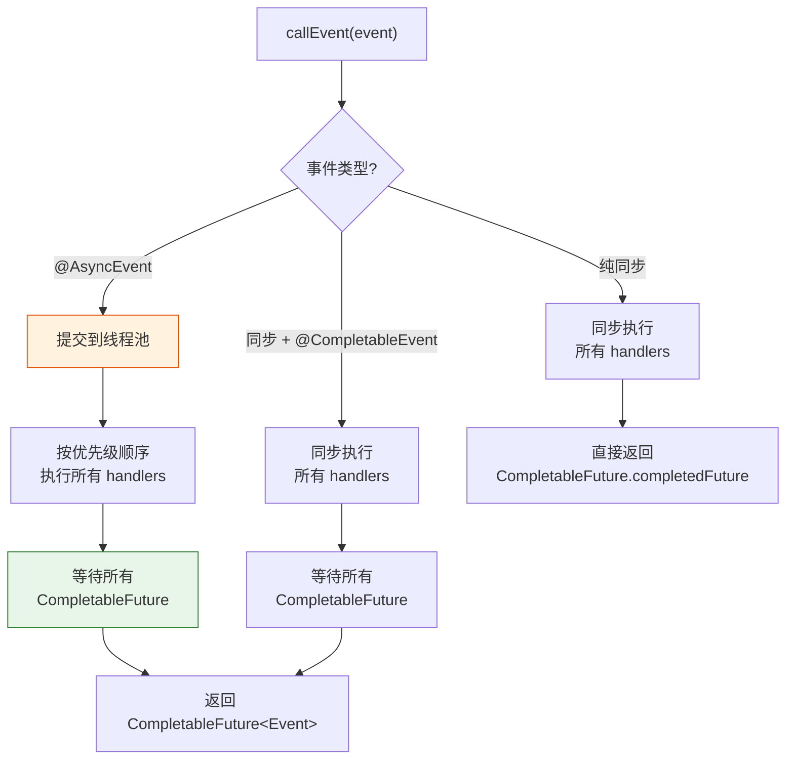
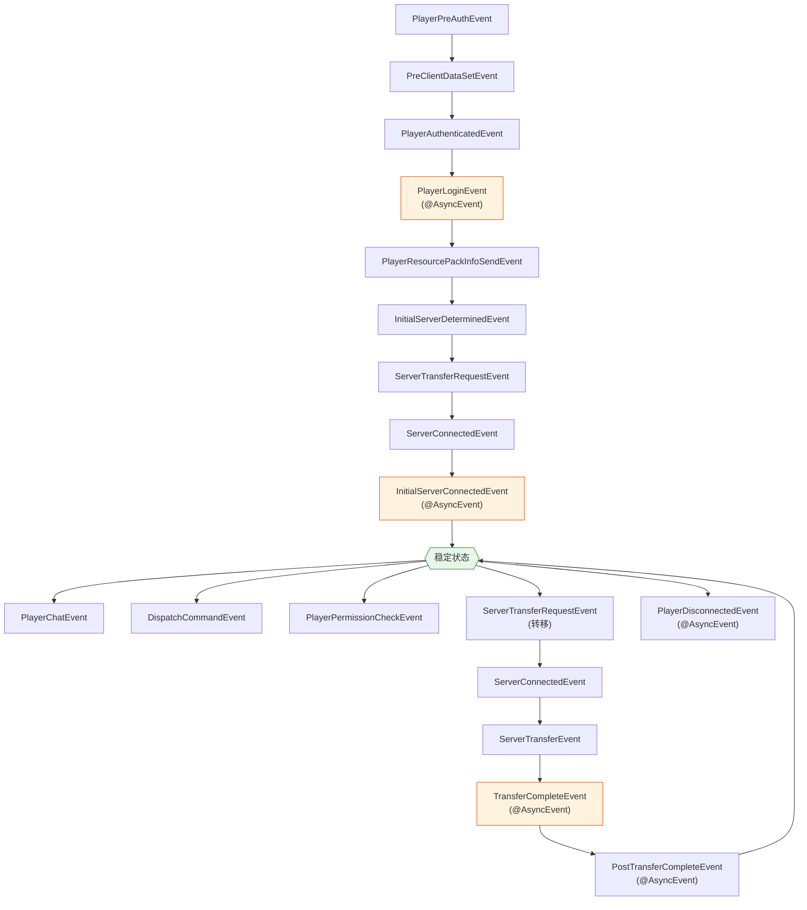

# 七、事件系统

## 7.1 架构概览



## 7.2 事件分发流程



## 7.3 完整事件列表

### 玩家认证与登录

| 事件 | 触发时机 | 可取消 | 异步 |
|---|---|---|---|
| `PlayerPreAuthEvent` | 链校验完成后、Xbox 认证检查前 | 否 | 否 |
| `PlayerAuthenticatedEvent` | LoginPacket 解码成功后 | 是 | 否 |
| `PreClientDataSetEvent` | 构建 `LoginData` 前 | 否 | 否 |
| `PlayerLoginEvent` | `initPlayer()` 中 | 是 | 是 |

### 资源包

| 事件 | 触发时机 | 可取消 | 异步 |
|---|---|---|---|
| `PlayerResourcePackInfoSendEvent` | 发送资源包信息时 | 是 | 否 |
| `PlayerResourcePackApplyEvent` | 玩家应用资源包时 | 否 | 否 |
| `ResourcePacksRebuildEvent` | 重建资源包列表时 | 否 | 是 |

### 服务器连接与转移

| 事件 | 触发时机 | 可取消 | 异步 |
|---|---|---|---|
| `InitialServerDeterminedEvent` | 确定初始服务器后 | 否 | 是 |
| `ServerTransferRequestEvent` | 发起服务器转移前 | 是 | 否 |
| `ServerConnectedEvent` | 下游连接成功后 | 是 | 否 |
| `ServerTransferEvent` | 开始服务器转移时 | 否 | 否 |
| `InitialServerConnectedEvent` | 首次连接服务器成功 | 否 | 是 |
| `TransferCompleteEvent` | 服务器转移完成 | 否 | 是 |
| `PostTransferCompleteEvent` | 转移完成后的额外处理 | 否 | 是 |
| `FastTransferRequestEvent` | 快速转移请求时 | 是 | 否 |

### 玩家行为

| 事件 | 触发时机 | 可取消 | 异步 |
|---|---|---|---|
| `PlayerChatEvent` | 玩家发送聊天消息 | 是 | 否 |
| `PlayerPermissionCheckEvent` | `hasPermission()` 检查时 | 否 | 否 |
| `PlayerDisconnectedEvent` | 玩家断开连接 | 否 | 是 |
| `DispatchCommandEvent` | 命令执行前 | 是 | 否 |

### 代理全局

| 事件 | 触发时机 | 可取消 | 异步 |
|---|---|---|---|
| `ProxyPingEvent` | 客户端 Ping 请求 | 否 | 否 |
| `ProxyQueryEvent` | Query 查询到达 | 否 | 否 |
| `ProxyStartEvent` | 代理启动完成 | 否 | 否 |

## 7.4 事件在生命周期中的触发顺序



## 7.5 使用示例

```java
// 订阅事件（指定优先级）
proxy.getEventManager().subscribe(PlayerLoginEvent.class, event -> {
    ProxiedPlayer player = event.getPlayer();
    if (isBanned(player)) {
        event.setCancelled(true);
        event.setCancelReason("You are banned!");
    }
}, EventPriority.HIGH);

// 分发事件并处理结果
proxy.getEventManager().callEvent(new ServerTransferRequestEvent(player, server))
    .whenComplete((event, error) -> {
        if (error != null) {
            logger.error("Event error", error);
        } else if (!event.isCancelled()) {
            // 继续转移
        }
    });
```
