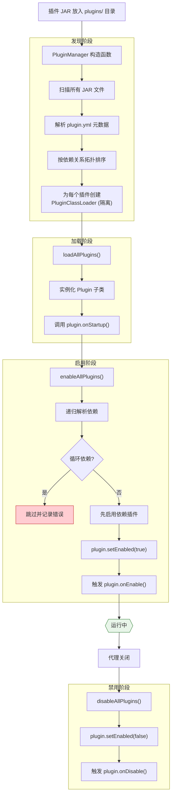
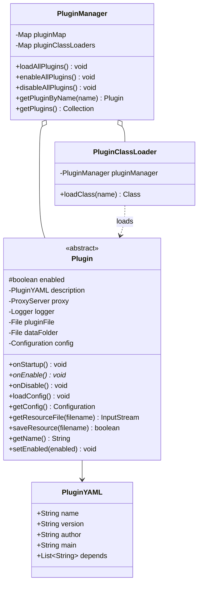

# 八、插件系统

## 8.1 插件生命周期



## 8.2 核心类

### Plugin 基类



## 8.3 `waterdog.yml` / `plugin.yml` 配置格式

> 插件加载器会先查找 `waterdog.yml`，找不到时再回退到 `plugin.yml`。
> 当前强制要求的字段只有 `name` 和 `main`；`version`、`author`、`depends` 为可选。

```yaml
name: MyPlugin              # 插件唯一名称（必填）
main: com.example.MyPlugin  # 主类全限定名（必填，需继承 Plugin）
version: 1.0.0              # 版本号（可选）
author: AuthorName          # 作者（可选）
depends:                    # 依赖列表（可选）
  - AnotherPlugin
  - RequiredLib
```

## 8.4 插件可用的钩子

| 钩子类型 | API | 说明 |
|---|---|---|
| **事件监听** | `eventManager.subscribe()` | 拦截登录、聊天、转移等事件 |
| **命令注册** | `commandMap.registerCommand()` | 注册自定义命令 |
| **数据包拦截** | `PluginPacketHandler` | 在 ProxyBatchBridge 管线中拦截数据包 |
| **定时任务** | `scheduler.scheduleRepeating()` | Tick 驱动的定时逻辑 |
| **权限管理** | `player.addPermission()` | 动态权限控制 |
| **配置管理** | `plugin.loadConfig()` | YAML 配置读写 |

## 8.5 插件开发示例

```java
public class MyPlugin extends Plugin {

    @Override
    public void onStartup() {
        // 插件加载时执行（在 onEnable 之前）
        getLogger().info("Plugin loading...");
    }

    @Override
    public void onEnable() {
        // 加载配置
        loadConfig();

        // 注册事件
        getProxy().getEventManager().subscribe(
            PlayerLoginEvent.class,
            this::onPlayerLogin,
            EventPriority.NORMAL
        );

        // 注册命令
        getProxy().getCommandMap().registerCommand(new MyCommand());

        // 定时任务
        getProxy().getScheduler().scheduleRepeating(() -> {
            // 每 20 tick (约1秒) 执行
        }, 20);

        getLogger().info("Plugin enabled!");
    }

    private void onPlayerLogin(PlayerLoginEvent event) {
        ProxiedPlayer player = event.getPlayer();
        player.sendMessage("Welcome to the server!");
    }

    @Override
    public void onDisable() {
        getLogger().info("Plugin disabled!");
    }
}
```
