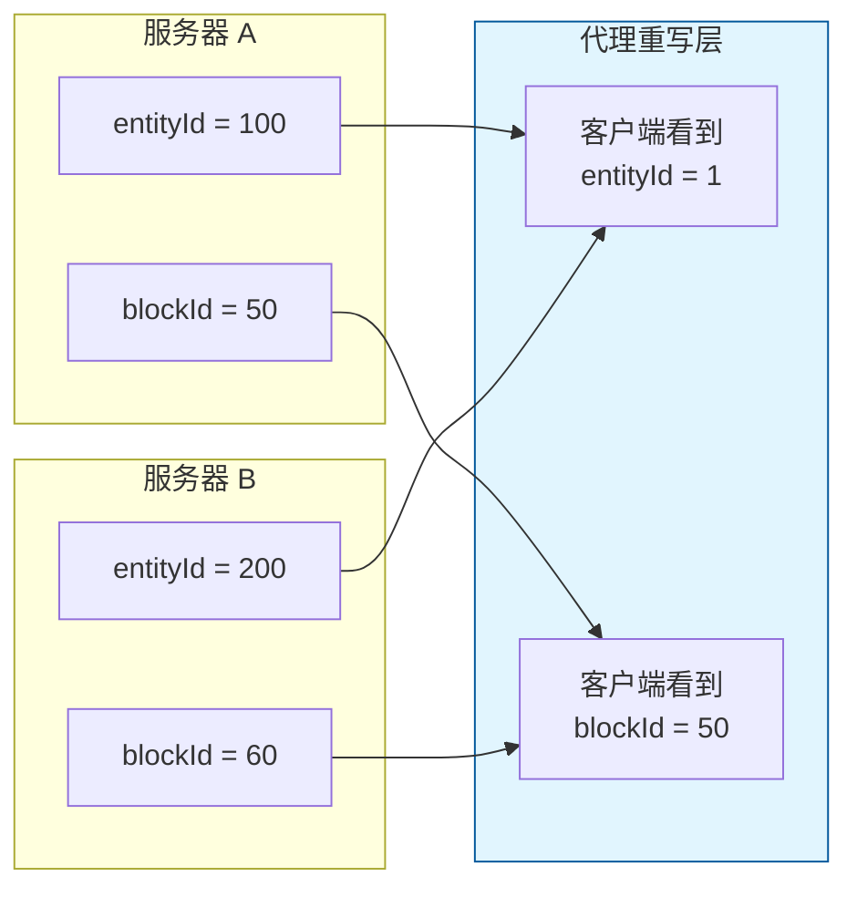
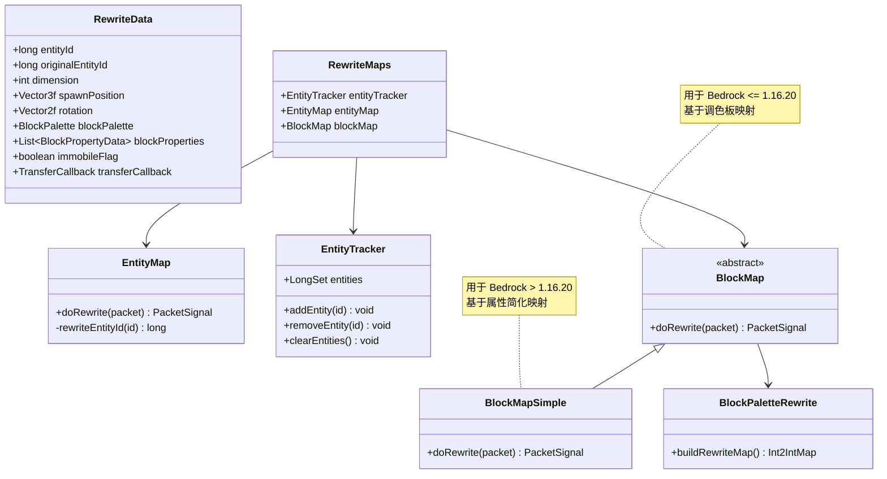
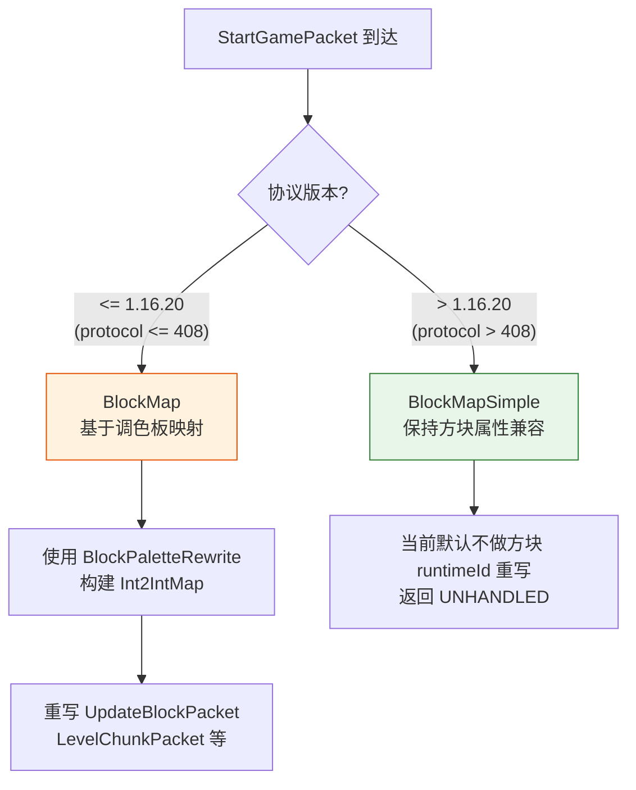

# 九、协议重写层

## 9.1 重写原理

当玩家在不同后端服务器之间切换时，每个服务器会为同一个玩家分配不同的实体 ID，使用不同的方块调色板。代理层必须重写这些 ID，确保客户端始终看到一致的数据。

## 9.2 核心组件

## 9.3 RewriteData 核心字段

| 字段 | 说明 |
|---|---|
| `entityId` | 客户端知道的实体 ID（由代理分配） |
| `originalEntityId` | 下游服务器分配的实体 ID |
| `dimension` | 当前维度 (0=Overworld, 1=Nether, 2=End) |
| `spawnPosition` | 出生点位置 |
| `blockPalette` | 方块调色板 NBT（旧版本 <= 1.16.20） |
| `blockProperties` | 方块属性 NBT（新版本 > 1.16.20） |
| `immobileFlag` | 不可移动状态标志（转移期间使用） |
| `transferCallback` | 转移回调引用 |

## 9.4 EntityMap 重写的数据包类型

EntityMap 需要重写所有包含实体运行时 ID 的数据包：

| 数据包 | 重写内容 |
|---|---|
| `MoveEntityAbsolutePacket` | runtimeEntityId |
| `EntityEventPacket` | runtimeEntityId |
| `MobEffectPacket` | runtimeEntityId |
| `MobEquipmentPacket` | runtimeEntityId |
| `MobArmorEquipmentPacket` | runtimeEntityId |
| `SetEntityDataPacket` | runtimeEntityId + metadata 中的实体引用 |
| `SetEntityLinkPacket` | riddenEntityId, riderEntityId |
| `AnimatePacket` | runtimeEntityId |
| `AddEntityPacket` | runtimeEntityId, uniqueEntityId |
| `AddPlayerPacket` | runtimeEntityId, uniqueEntityId |
| `RemoveEntityPacket` | uniqueEntityId |
| `TakeItemEntityPacket` | runtimeEntityId, itemEntityId |
| `BossEventPacket` | bossUniqueEntityId |
| ... | 以及其他包含实体 ID 的数据包 |

## 9.5 BlockMap 版本选择

## 9.6 重写时机

重写发生在 `ProxyBatchBridge.onBedrockBatch()` 的处理流程中：

1. 数据包被解码
2. 处理器（Handler）先处理数据包
3. `doPacketRewrite()` 执行重写
4. 上游包：EntityMap 重写实体 ID
5. 下游包：旧版本主要由 `BlockMap + EntityMap` 重写；新版本默认主要依赖 `EntityMap`
6. 根据信号决定是否需要重新编码
