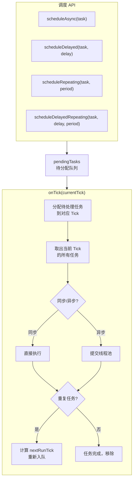
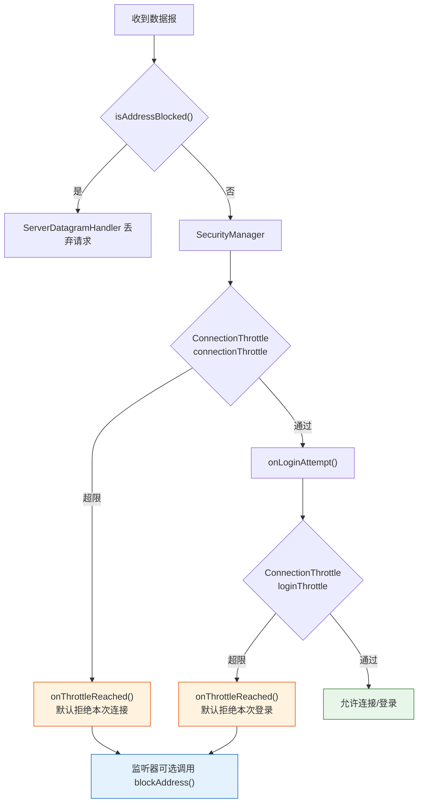
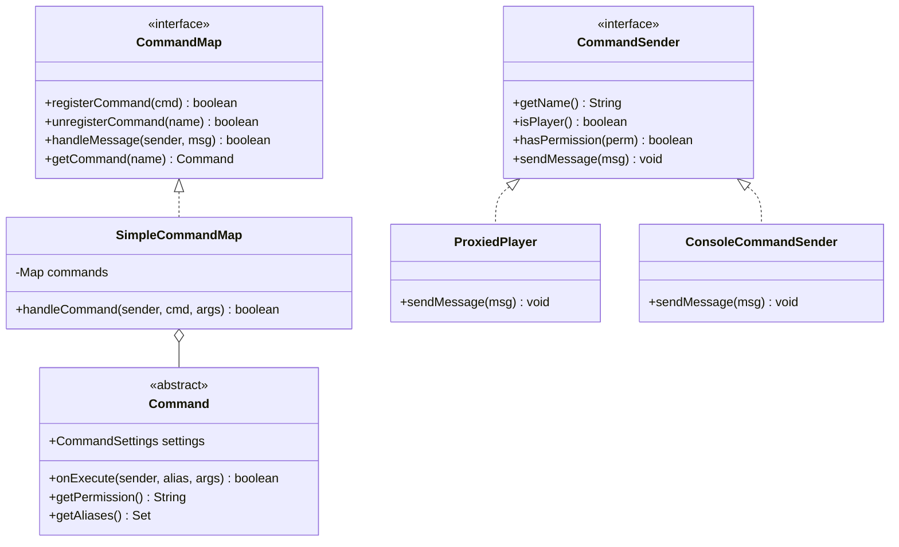
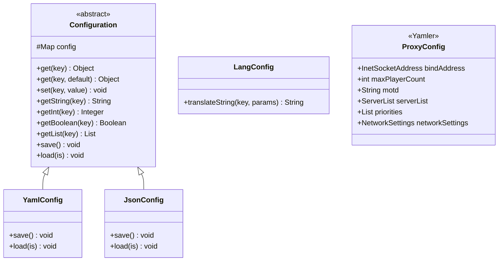
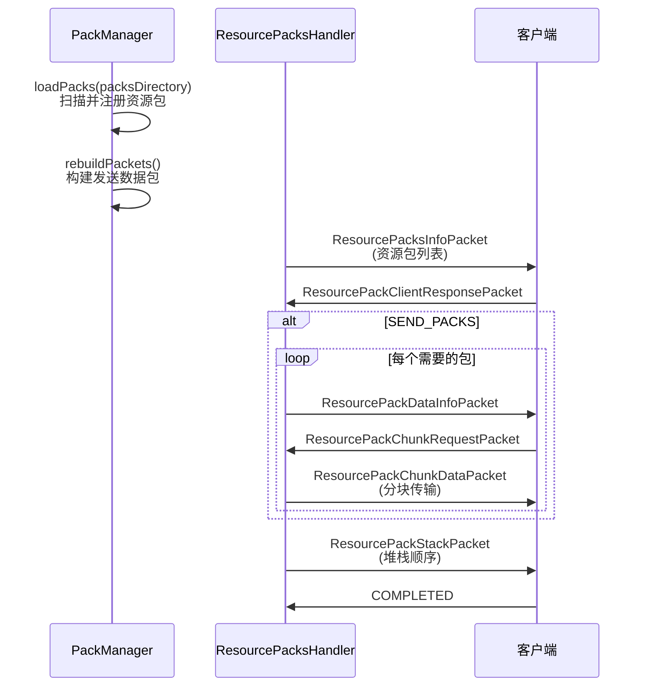

# 十、其他子系统

## 10.1 调度系统（Scheduler）

### 架构

### 核心类

| 类 | 职责 |
|---|---|
| `WaterdogScheduler` | Tick 驱动的任务调度器，管理任务注册和执行 |
| `TaskHandler<T>` | 单个任务的包装器，记录 ID、延迟、周期、下次执行 Tick |
| `Task` | 任务抽象基类，提供 `onRun()`、`onCancel()`、`onError()` |
| `CallbackTask` | 基于 Runnable 的简单回调任务 |

### 调度方法

| 方法 | 延迟 | 重复 | 异步 |
|---|---|---|---|
| `scheduleAsync(task)` | 否 | 否 | 是 |
| `scheduleTask(task, async)` | 否 | 否 | 可选 |
| `scheduleDelayed(task, delay)` | 是 | 否 | 可选 |
| `scheduleRepeating(task, period)` | 否 | 是 | 可选 |
| `scheduleDelayedRepeating(task, delay, period)` | 是 | 是 | 可选 |

---

## 10.2 安全系统（Security）

### 架构

### ConnectionThrottle 工作机制

| 步骤 | 操作 |
|---|---|
| 请求到达 IP X | 检查 ExpiringMap 中的记录 |
| X 无记录 | 创建 `Entry(limit)`，计数 → 1，返回 true |
| X 计数 < limit | 计数 + 1，返回 true |
| X 计数 >= limit | 返回 false，并回调 `onThrottleReached()`；不会自动调用 `blockAddress()` |
| 记录在 throttleTime 后自动过期 | |

---

## 10.3 命令系统（Command）

### 架构

### 内置命令

| 命令 | 类 | 说明 |
|---|---|---|
| `help` | `HelpCommand` | 显示帮助信息 |
| `list` | `ListCommand` | 显示在线玩家列表 |
| `server` | `ServerCommand` | 切换服务器 |
| `send` | `SendCommand` | 发送玩家到指定服务器 |
| `end` | `EndCommand` | 关闭代理 |
| `info` | `InfoCommand` | 显示系统信息 |
| `plugins` | `PluginsCommand` | 显示已加载插件 |
| `status` | `StatusCommand` | 显示代理状态 |

---

## 10.4 配置系统（Config）

支持嵌套键（dot notation）：`"server.name"` 自动解析为 `map["server"]["name"]`

---

## 10.5 资源包系统（PackManager）

### 资源包分类

| 类型 | 常量 | 适用范围 |
|---|---|---|
| 资源包（纹理、音乐等） | `TYPE_RESOURCES` | 通用（UNIVERSAL） |
| 行为包 | `TYPE_DATA` / `TYPE_BEHAVIOR` | 仅网易客户端 |

### 协议版本适配

| 版本 | 行为 |
|---|---|
| v729+ | `behaviorPackInfos` 合并到 `resourcePackInfos` |
| v898+ | `behaviorPacks` 合并到 `resourcePacks` |

### 资源包处理流程

