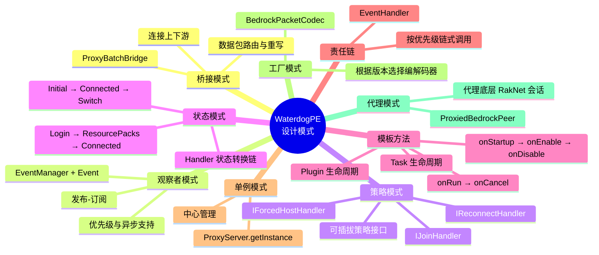

# 十一、关键依赖库与设计模式

## 11.1 依赖坐标概览

以下列表使用 **Maven 坐标** 表示依赖，适合作为外部阅读、依赖排查和版本比对的参考。版本信息与当前仓库 `pom.xml` 保持一致。

### 核心协议与网络依赖

| Maven 坐标 | 版本 | 用途 |
|---|---|---|
| `org.cloudburstmc.protocol:bedrock-codec` | `3.0.0.Beta12-SNAPSHOT` | Bedrock 协议序列化/反序列化 |
| `org.cloudburstmc.protocol:bedrock-connection` | `3.0.0.Beta12-SNAPSHOT` | Bedrock 连接管理和会话生命周期 |
| `org.cloudburstmc.netty:netty-transport-raknet` | `1.0.0.CR3-SNAPSHOT` | RakNet 传输层（UDP 可靠传输） |
| `org.allaymc:protocol-extension` | `0.1.6` | 网易协议编解码扩展 |
| `io.netty:netty-transport-native-epoll` | `4.1.101.Final` | Linux 原生传输支持（`linux-x86_64` classifier） |
| `io.netty:netty-transport-native-kqueue` | `4.1.101.Final` | macOS 原生传输支持（`osx-x86_64` classifier） |

### 运行时与工具依赖

| Maven 坐标 | 版本 | 用途 |
|---|---|---|
| `org.projectlombok:lombok` | `1.18.30` | 编译时代码生成（如 `@Getter`、`@Setter`） |
| `org.apache.logging.log4j:log4j-api` | `2.25.3` | Log4j2 日志 API |
| `org.apache.logging.log4j:log4j-core` | `2.25.3` | Log4j2 日志实现 |
| `com.lmax:disruptor` | `3.4.4` | Log4j2 异步日志依赖 |
| `org.jline:jline` | `3.30.6` | 控制台交互基础组件 |
| `org.jline:jline-terminal` | `3.30.6` | 终端抽象层 |
| `org.jline:jline-terminal-jna` | `3.30.6` | JNA 终端支持 |
| `org.jline:jline-reader` | `3.30.6` | 命令行读取与补全 |
| `net.minecrell:terminalconsoleappender` | `1.3.0` | 控制台日志与命令行整合 |
| `net.cubespace:Yamler-Core` | `2.4.1-SNAPSHOT` | 注解驱动的 YAML 配置框架 |
| `org.yaml:snakeyaml` | `1.32` | YAML 解析 |
| `com.google.code.gson:gson` | `2.10.1` | JSON 序列化 |
| `it.unimi.dsi:fastutil` | `8.5.12` | 高性能原始类型集合 |
| `org.apache.commons:commons-lang3` | `3.18.0` | Apache 通用工具类 |
| `com.nimbusds:nimbus-jose-jwt` | `9.37.4` | Xbox Live 认证 JWT 处理 |
| `com.bugsnag:bugsnag` | `[3.0,4.0)` | 错误追踪上报 |
| `org.bstats:bstats-base` | `3.0.1` | 匿名统计 |

---

## 11.2 设计模式总结

### 模式详解

| 模式 | 应用场景 | 核心类 |
|---|---|---|
| **桥接模式** | 上下游数据包路由，解耦编解码与业务处理 | `ProxyBatchBridge` |
| **观察者模式** | 事件发布-订阅，插件可扩展监听 | `EventManager`, `Event`, `EventHandler` |
| **策略模式** | 连接策略可插拔，代理行为可自定义 | `IJoinHandler`, `IForcedHostHandler` |
| **状态模式** | 处理器按协议阶段自动切换 | `LoginUpstreamHandler` → `ResourcePacksHandler` → `ConnectedUpstreamHandler` |
| **模板方法** | 插件和任务的标准化生命周期 | `Plugin`, `Task` |
| **责任链** | 事件按优先级链式处理 | `EventHandler` 优先级分组 |
| **单例模式** | 中央管理器全局唯一 | `ProxyServer` |
| **工厂模式** | 根据运行时条件创建不同实现 | `BedrockPacketCodec`, `PackManager` |
| **代理模式** | 包装底层网络会话，添加代理逻辑 | `ProxiedBedrockPeer` |
